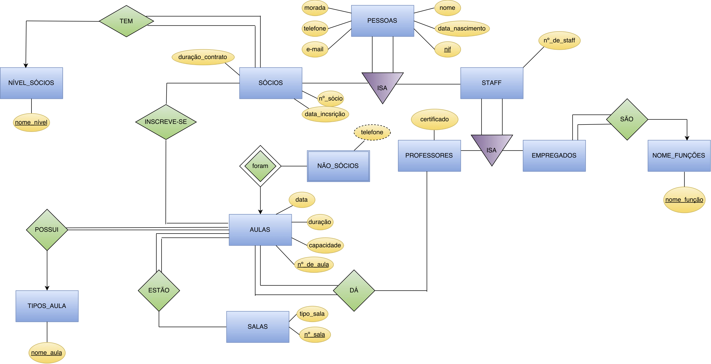

# Gym Database
## An Oracle relational database, developed as part of a university Database course at Faculdade de Ciências e Tecnologias da Universidade Nova de Lisboa.
### It contains the necessary SQL code to initialize the database (ER_ginasio.sql). It also includes code that allows the database to control the entry to the gym according to the contract status of the gym client, using an electronic card. (atualizacao_entrada.sql, update_entrada.sql, leitor_cartoes.sql).
### It also contains the Entity-Relationship diagram, and the Relational model diagram.

## Entity-Relationship diagram:

## Relational model diagram:

